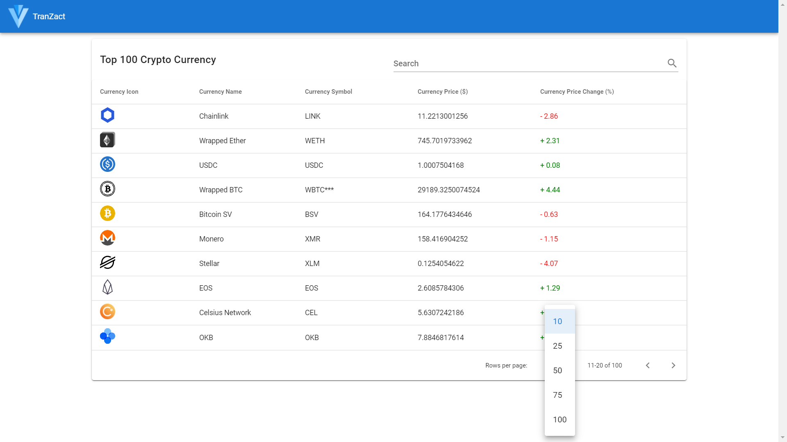

# Top 100 Crypto Currencies

You can check out live demo [here](https://top100crypto-currency.netlify.app/)

* This project shows real time rates of top 100 crypto currencies where the data is fetched from [https://api.coinranking.com/v1/public/coins/?limit=100](https://api.coinranking.com/v1/public/coins/?limit=100) API and the data is stored in Vuex(Vue State management library). 
* The rates keep on updating on regular interval by hitting the data on fixed set of intervals so that we always get the latest rates. 
* The rates in form of Vuetify Data table where we can see the number of records we want to see, search a particular crypto currency and sort them on any column. 
* Also the price change % is shown in green if it's positive and in red if it's negative to enhance the visual.



## Project setup
```
npm install
```

### Compiles and hot-reloads for development
```
npm run serve
```

### Compiles and minifies for production
```
npm run build
```

### Lints and fixes files
```
npm run lint
```

### Customize configuration
See [Configuration Reference](https://cli.vuejs.org/config/).
